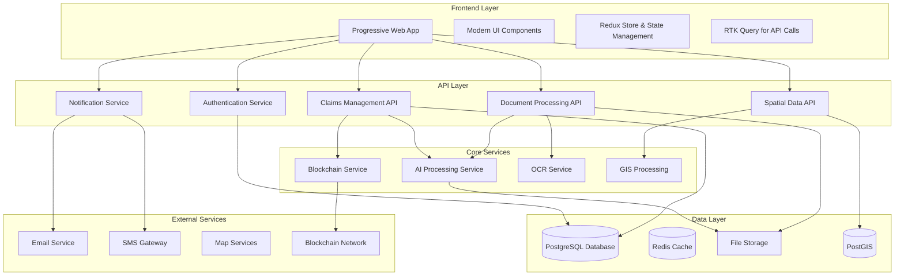

# Design Document

## Overview

The FRA Atlas application will be transformed into a modern, comprehensive forest rights management platform. This design addresses structural issues, implements missing components, and introduces advanced features including AI-powered document processing, blockchain integration, spatial data management, and real-time communication capabilities.

## Architecture

### High-Level Architecture



### Technology Stack

- **Frontend**: Next.js 15, React 19, TypeScript, Tailwind CSS, Redux Toolkit
- **State Management**: Redux Toolkit with RTK Query for API state management
- **Backend**: Next.js API Routes, Prisma ORM
- **Database**: Neon PostgreSQL with PostGIS extension
- **Caching**: Redis for session management and caching
- **File Storage**: Local file system with future cloud storage option
- **AI/ML**: OpenAI API for document processing
- **Blockchain**: Ethereum or Polygon for transparency
- **Maps**: Leaflet with OpenStreetMap
- **Real-time**: WebSockets for notifications
- **PWA**: Service Workers for offline functionality

### State Management Architecture

The application uses Redux Toolkit for centralized state management with the following structure:

```typescript
// Store Structure
interface RootState {
  auth: AuthState
  claims: ClaimsState
  documents: DocumentsState
  spatial: SpatialState
  notifications: NotificationsState
  ui: UIState
  offline: OfflineState
}

// RTK Query API Slices
- authApi: Authentication and user management
- claimsApi: Claims CRUD operations and workflows
- documentsApi: Document upload and processing
- spatialApi: Spatial data and mapping
- notificationsApi: Real-time notifications
- analyticsApi: Dashboard and reporting data
```

## Components and Interfaces

### 1. Authentication System

#### Components

- `LoginForm`: Modern login interface with validation
- `RegisterForm`: Multi-step registration process
- `ForgotPasswordForm`: Password reset functionality
- `AuthGuard`: Route protection component
- `RoleBasedAccess`: Permission-based component rendering

#### Interfaces

```typescript
interface User {
  id: string;
  email: string;
  name: string;
  role: UserRole;
  permissions: Permission[];
  profile: UserProfile;
}

interface AuthState {
  user: User | null;
  isAuthenticated: boolean;
  isLoading: boolean;
  permissions: Permission[];
  token: string | null;
  refreshToken: string | null;
}

// Additional Redux Store Slices
interface ClaimsState {
  claims: Claim[];
  currentClaim: Claim | null;
  filters: ClaimFilters;
  pagination: PaginationState;
  isLoading: boolean;
  error: string | null;
}

interface DocumentsState {
  documents: Document[];
  uploadProgress: Record<string, number>;
  processingStatus: Record<string, ProcessingStatus>;
  isLoading: boolean;
  error: string | null;
}

interface SpatialState {
  mapCenter: [number, number];
  mapZoom: number;
  selectedFeatures: SpatialBoundary[];
  drawingMode: DrawingMode;
  layers: MapLayer[];
  isLoading: boolean;
}

interface NotificationsState {
  notifications: Notification[];
  unreadCount: number;
  preferences: NotificationPreferences;
  isConnected: boolean;
}

interface UIState {
  theme: "light" | "dark";
  language: string;
  sidebarOpen: boolean;
  modals: Record<string, boolean>;
  loading: Record<string, boolean>;
}

interface OfflineState {
  isOnline: boolean;
  pendingActions: OfflineAction[];
  syncStatus: SyncStatus;
  lastSync: Date | null;
}
```

### 2. Claims Management System

#### Components

- `ClaimSubmissionWizard`: Multi-step claim submission
- `ClaimsList`: Paginated claims table with filters
- `ClaimDetails`: Comprehensive claim view
- `DecisionSupportPanel`: AI-powered decision recommendations with visual analytics
- `ClaimAnalyticsDashboard`: Interactive charts showing claim patterns and trends
- `ClaimStatusTracker`: Visual status timeline
- `ClaimWorkflow`: Official review interface
- `ClaimSearch`: Advanced search and filtering

### 3. Document Processing System with EasyOCR and NER

#### Components

- `DocumentUploader`: Drag-and-drop file upload with real-time progress visualization
- `EasyOCRProcessor`: Python backend service for multi-language OCR processing
- `NEREntityExtractor`: Named Entity Recognition service for extracting structured data
- `DocumentViewer`: Interactive PDF/image viewer with entity highlighting overlays
- `EntityVisualizationPanel`: Color-coded display of extracted entities with confidence scores
- `OCRResultsDisplay`: Interactive text extraction results with editing capabilities
- `ProcessingStatusIndicator`: Animated progress bars and status updates
- `DocumentVerificationInterface`: Official review panel with AI recommendations
- `EntityConfidenceChart`: Visual representation of extraction confidence levels
- `DocumentAnalyticsDashboard`: Analytics for document processing performance

#### Interfaces

```typescript
interface OCRResult {
  id: string;
  documentId: string;
  extractedText: string;
  confidence: number;
  language: string;
  processingTime: number;
  boundingBoxes: BoundingBox[];
  entities: ExtractedEntity[];
  status: OCRStatus;
}

interface ExtractedEntity {
  id: string;
  type: EntityType; // PERSON, LOCATION, DATE, AREA, etc.
  value: string;
  confidence: number;
  startIndex: number;
  endIndex: number;
  boundingBox?: BoundingBox;
  verified: boolean;
}

interface BoundingBox {
  x: number;
  y: number;
  width: number;
  height: number;
}

interface DocumentProcessingState {
  ocrResults: Record<string, OCRResult>;
  processingQueue: string[];
  currentProcessing: string | null;
  extractedEntities: Record<string, ExtractedEntity[]>;
  verificationStatus: Record<string, VerificationStatus>;
  isProcessing: boolean;
  error: string | null;
}
```

### 4. Decision Support System (DSS)

#### Components

- `DecisionSupportDashboard`: Main DSS interface with recommendation panels
- `RecommendationEngine`: AI-powered decision recommendation system
- `PrecedentCaseViewer`: Display of similar historical cases
- `RiskAssessmentPanel`: Visual risk factor analysis with color-coded indicators
- `DecisionFactorsMatrix`: Interactive matrix of decision criteria
- `ConfidenceScoreIndicator`: Visual confidence level displays
- `DecisionReasoningExplainer`: Transparent AI reasoning explanations
- `OutcomePredictionChart`: Predictive analytics for decision outcomes
- `DecisionHistoryTracker`: Timeline of past decisions and their outcomes
- `ComplianceChecker`: Automated compliance verification with visual indicators

#### Interfaces

```typescript
interface DSSRecommendation {
  id: string;
  claimId: string;
  recommendedAction: DecisionAction;
  confidence: number;
  reasoning: string[];
  riskFactors: RiskFactor[];
  precedentCases: PrecedentCase[];
  complianceStatus: ComplianceStatus;
  factors: DecisionFactor[];
  createdAt: Date;
}

interface DecisionFactor {
  id: string;
  name: string;
  weight: number;
  value: number;
  impact: "positive" | "negative" | "neutral";
  description: string;
}

interface RiskFactor {
  id: string;
  type: RiskType;
  severity: "low" | "medium" | "high" | "critical";
  description: string;
  mitigation: string;
  probability: number;
}

interface PrecedentCase {
  id: string;
  similarity: number;
  outcome: DecisionAction;
  factors: DecisionFactor[];
  date: Date;
  summary: string;
}

interface DSSState {
  recommendations: Record<string, DSSRecommendation>;
  isAnalyzing: boolean;
  precedentCases: PrecedentCase[];
  riskAssessment: Record<string, RiskFactor[]>;
  decisionHistory: DecisionHistoryEntry[];
  analyticsData: DSSAnalytics;
}
```

#### Interfaces

```typescript
interface Claim {
  id: string;
  claimNumber: string;
  claimant: ClaimantInfo;
  location: LocationInfo;
  documents: Document[];
  spatialData: SpatialBoundary[];
  status: ClaimStatus;
  workflow: WorkflowStep[];
  timeline: TimelineEvent[];
}

interface ClaimSubmissionData {
  claimantInfo: ClaimantInfo;
  locationInfo: LocationInfo;
  claimType: ClaimType;
  forestArea: number;
  documents: File[];
  spatialBoundaries: GeoJSON;
}
```

### 3. Document Management System

#### Components

- `DocumentUploader`: Drag-and-drop file upload with progress
- `DocumentViewer`: PDF/image viewer with annotations
- `DocumentProcessor`: AI-powered document analysis
- `DocumentVerification`: Official verification interface
- `OCRResults`: Extracted text and entities display

#### Interfaces

```typescript
interface Document {
  id: string;
  filename: string;
  fileType: string;
  fileSize: number;
  uploadDate: Date;
  ocrText?: string;
  extractedEntities?: ExtractedEntity[];
  verificationStatus: DocumentStatus;
  aiAnalysis?: AIAnalysisResult;
}

interface AIAnalysisResult {
  confidence: number;
  extractedData: Record<string, any>;
  flags: ValidationFlag[];
  recommendations: string[];
}
```

### 4. Spatial Data Management

#### Components

- `InteractiveMap`: Leaflet-based map with drawing tools
- `BoundaryDrawer`: Polygon drawing and editing
- `SpatialSearch`: Location-based search
- `LayerManager`: Map layer control
- `MeasurementTools`: Area and distance calculation

#### Interfaces

```typescript
interface SpatialBoundary {
  id: string;
  type: "forest" | "claim" | "village";
  geoJsonData: GeoJSON.Feature;
  area: number;
  perimeter: number;
  metadata: SpatialMetadata;
}

interface MapState {
  center: [number, number];
  zoom: number;
  layers: MapLayer[];
  selectedFeatures: SpatialBoundary[];
  drawingMode: DrawingMode;
}
```

### 5. Real-time Notification System

#### Components

- `NotificationCenter`: Centralized notification display
- `NotificationBell`: Header notification indicator
- `NotificationSettings`: User preference management
- `MessageThread`: Communication interface
- `AlertBanner`: System-wide alerts

#### Interfaces

```typescript
interface Notification {
  id: string;
  type: NotificationType;
  title: string;
  message: string;
  timestamp: Date;
  read: boolean;
  actionUrl?: string;
  priority: "low" | "medium" | "high" | "urgent";
}

interface NotificationPreferences {
  email: boolean;
  sms: boolean;
  inApp: boolean;
  categories: NotificationCategory[];
}
```

### 6. Analytics and Reporting

#### Components

- `AnalyticsDashboard`: Comprehensive metrics display
- `ReportBuilder`: Custom report generation
- `ChartComponents`: Various chart types (pie, bar, line, heatmap)
- `DataExporter`: Export functionality
- `TrendAnalysis`: Predictive analytics display

#### Interfaces

```typescript
interface AnalyticsData {
  totalClaims: number;
  claimsByStatus: StatusDistribution;
  claimsByRegion: RegionDistribution;
  processingTimes: ProcessingMetrics;
  trends: TrendData[];
}

interface ReportConfig {
  type: ReportType;
  dateRange: DateRange;
  filters: ReportFilter[];
  format: "pdf" | "excel" | "csv";
  schedule?: ScheduleConfig;
}
```

## Data Models

### Enhanced Database Schema

```prisma
model User {
  id                String              @id @default(cuid())
  email             String              @unique
  password          String
  name              String?
  role              UserRole            @default(CLAIMANT)
  permissions       Permission[]
  profile           UserProfile?
  preferences       UserPreferences?
  lastLogin         DateTime?
  isActive          Boolean             @default(true)
  emailVerified     Boolean             @default(false)
  phoneVerified     Boolean             @default(false)
  createdAt         DateTime            @default(now())
  updatedAt         DateTime            @updatedAt

  // Relations
  claims            ForestRightsClaim[]
  documents         ClaimDocument[]
  workflowActions   ClaimWorkflow[]
  auditLogs         AuditTrail[]
  notifications     Notification[]
  messages          Message[]
  sessions          UserSession[]
}

model UserProfile {
  id              String   @id @default(cuid())
  userId          String   @unique
  user            User     @relation(fields: [userId], references: [id])
  phone           String?
  address         Address?
  avatar          String?
  language        String   @default("en")
  timezone        String   @default("Asia/Kolkata")
  bio             String?
  socialLinks     Json?
  createdAt       DateTime @default(now())
  updatedAt       DateTime @updatedAt
}

model ForestRightsClaim {
  id                    String                @id @default(cuid())
  claimNumber           String                @unique
  claimantName          String
  claimantPhone         String?
  claimantEmail         String?
  villageName           String
  district              String
  state                 String
  pincode               String?
  forestAreaHectares    Float
  claimType             ClaimType
  status                ClaimStatus           @default(SUBMITTED)
  priority              Priority              @default(NORMAL)
  submissionDate        DateTime              @default(now())
  lastUpdated           DateTime              @updatedAt
  expectedCompletionDate DateTime?
  actualCompletionDate  DateTime?

  // Enhanced fields
  gpsCoordinates        Json?
  landUseType           String?
  traditionalUse        String?
  familyMembers         Int?
  dependentFamilies     Int?
  livelihoodDetails     String?

  // Relations
  userId                String
  user                  User                  @relation(fields: [userId], references: [id])
  documents             ClaimDocument[]
  spatialBoundaries     SpatialBoundary[]
  workflows             ClaimWorkflow[]
  decisionFactors       DecisionFactor[]
  blockchainRecords     BlockchainRecord[]
  auditLogs             AuditTrail[]
  notifications         Notification[]
  messages              Message[]
  timeline              TimelineEvent[]

  @@index([status, district, state])
  @@index([submissionDate])
  @@index([claimantName])
}

model ClaimDocument {
  id                    String              @id @default(cuid())
  filename              String
  originalFilename      String
  fileType              String
  fileSize              Int
  filePath              String
  uploadDate            DateTime            @default(now())
  ocrText               String?
  extractedEntities     Json?
  verificationStatus    DocumentStatus      @default(PENDING)
  aiAnalysis            Json?
  confidenceScore       Float?
  processingStatus      ProcessingStatus    @default(PENDING)

  // Relations
  claimId               String
  claim                 ForestRightsClaim   @relation(fields: [claimId], references: [id])
  uploadedById          String
  uploadedBy            User                @relation(fields: [uploadedById], references: [id])

  @@index([claimId])
  @@index([verificationStatus])
}

model Notification {
  id            String            @id @default(cuid())
  type          NotificationType
  title         String
  message       String
  data          Json?
  read          Boolean           @default(false)
  actionUrl     String?
  priority      Priority          @default(NORMAL)
  expiresAt     DateTime?
  createdAt     DateTime          @default(now())

  // Relations
  userId        String
  user          User              @relation(fields: [userId], references: [id])
  claimId       String?
  claim         ForestRightsClaim? @relation(fields: [claimId], references: [id])

  @@index([userId, read])
  @@index([createdAt])
}

model Message {
  id            String            @id @default(cuid())
  subject       String
  content       String
  messageType   MessageType       @default(GENERAL)
  read          Boolean           @default(false)
  createdAt     DateTime          @default(now())

  // Relations
  senderId      String
  sender        User              @relation("SentMessages", fields: [senderId], references: [id])
  recipientId   String
  recipient     User              @relation("ReceivedMessages", fields: [recipientId], references: [id])
  claimId       String?
  claim         ForestRightsClaim? @relation(fields: [claimId], references: [id])
  parentId      String?
  parent        Message?          @relation("MessageThread", fields: [parentId], references: [id])
  replies       Message[]         @relation("MessageThread")
}

model TimelineEvent {
  id            String            @id @default(cuid())
  eventType     EventType
  title         String
  description   String?
  eventData     Json?
  timestamp     DateTime          @default(now())

  // Relations
  claimId       String
  claim         ForestRightsClaim @relation(fields: [claimId], references: [id])
  userId        String?
  user          User?             @relation(fields: [userId], references: [id])
}

// Enhanced Enums
enum NotificationType {
  CLAIM_SUBMITTED
  CLAIM_APPROVED
  CLAIM_REJECTED
  DOCUMENT_REQUIRED
  DOCUMENT_VERIFIED
  WORKFLOW_UPDATE
  DEADLINE_REMINDER
  SYSTEM_ALERT
  MESSAGE_RECEIVED
}

enum Priority {
  LOW
  NORMAL
  HIGH
  URGENT
}

enum ProcessingStatus {
  PENDING
  PROCESSING
  COMPLETED
  FAILED
}

enum MessageType {
  GENERAL
  OFFICIAL
  SYSTEM
  URGENT
}

enum EventType {
  CLAIM_CREATED
  DOCUMENT_UPLOADED
  STATUS_CHANGED
  WORKFLOW_ADVANCED
  DECISION_MADE
  MESSAGE_SENT
  SYSTEM_ACTION
}
```

## Error Handling

### Error Boundary Implementation

- Global error boundary for unhandled React errors
- API error handling with proper HTTP status codes
- Database error handling with transaction rollbacks
- File upload error handling with retry mechanisms
- Network error handling for offline scenarios

### Error Types

```typescript
interface AppError {
  code: string;
  message: string;
  details?: any;
  timestamp: Date;
  userId?: string;
  requestId?: string;
}

enum ErrorCodes {
  VALIDATION_ERROR = "VALIDATION_ERROR",
  AUTHENTICATION_ERROR = "AUTH_ERROR",
  AUTHORIZATION_ERROR = "AUTHZ_ERROR",
  DATABASE_ERROR = "DB_ERROR",
  FILE_UPLOAD_ERROR = "FILE_ERROR",
  EXTERNAL_SERVICE_ERROR = "EXT_SERVICE_ERROR",
  NETWORK_ERROR = "NETWORK_ERROR",
}
```

## Testing Strategy

### Unit Testing

- Component testing with React Testing Library
- API endpoint testing with Jest
- Database model testing with Prisma
- Utility function testing
- Custom hook testing

### Integration Testing

- End-to-end user flows with Playwright
- API integration testing
- Database integration testing
- File upload and processing testing
- Authentication flow testing

### Performance Testing

- Load testing for API endpoints
- Database query performance testing
- File upload performance testing
- Frontend rendering performance testing
- Mobile performance testing

### Security Testing

- Authentication and authorization testing
- Input validation testing
- SQL injection prevention testing
- XSS prevention testing
- CSRF protection testing

## Security Considerations

### Authentication & Authorization

- JWT tokens with refresh token rotation
- Role-based access control (RBAC)
- Multi-factor authentication for officials
- Session management with Redis
- Password hashing with bcrypt

### Data Protection

- Encryption at rest for sensitive data
- TLS encryption for data in transit
- Input sanitization and validation
- SQL injection prevention with Prisma
- XSS protection with Content Security Policy

### File Security

- File type validation and sanitization
- Virus scanning for uploaded files
- Secure file storage with access controls
- File size and upload rate limiting
- Metadata stripping from uploaded files

### API Security

- Rate limiting for API endpoints
- Request validation with Zod schemas
- CORS configuration
- API key management for external services
- Audit logging for all API calls

## Performance Optimization

### Frontend Optimization

- Code splitting with Next.js dynamic imports
- Image optimization with Next.js Image component
- Lazy loading for components and routes
- Service worker for caching and offline functionality
- Bundle size optimization with webpack analysis

### Backend Optimization

- Database query optimization with indexes
- Connection pooling for database connections
- Caching with Redis for frequently accessed data
- API response compression
- Background job processing for heavy tasks

### Database Optimization

- Proper indexing strategy
- Query optimization with EXPLAIN ANALYZE
- Connection pooling with PgBouncer
- Read replicas for analytics queries
- Partitioning for large tables

## Deployment Architecture

### Infrastructure

- Containerized deployment with Docker
- Kubernetes orchestration for scalability
- Load balancing with NGINX
- CDN for static asset delivery
- Database clustering for high availability

### CI/CD Pipeline

- Automated testing on pull requests
- Code quality checks with ESLint and Prettier
- Security scanning with Snyk
- Automated deployment to staging and production
- Database migration automation

### Monitoring & Observability

- Application performance monitoring with New Relic
- Error tracking with Sentry
- Log aggregation with ELK stack
- Uptime monitoring with Pingdom
- Custom metrics and alerting
