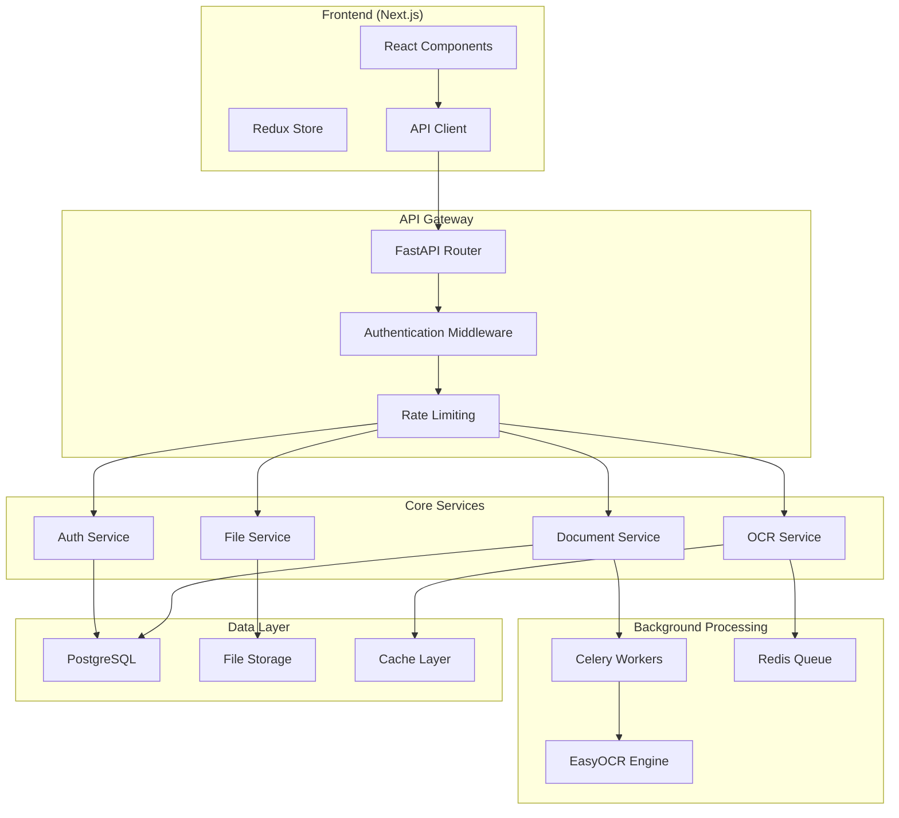

# Design Document

## Overview

This design implements a comprehensive solution for missing API routes and multilingual OCR capabilities using EasyOCR with FastAPI. The architecture follows modern API design patterns with asynchronous processing, proper error handling, and scalable document processing pipelines.

## Architecture

### High-Level Architecture



### Technology Stack

- **Backend Framework**: FastAPI with Python 3.11+
- **OCR Engine**: EasyOCR with GPU acceleration support
- **Task Queue**: Celery with Redis broker
- **Database**: PostgreSQL with async SQLAlchemy
- **File Storage**: Local filesystem with S3 compatibility
- **Authentication**: JWT with refresh tokens
- **API Documentation**: OpenAPI/Swagger with automatic generation
- **Monitoring**: Structured logging with correlation IDs

## Components and Interfaces

### 1. Authentication System

#### JWT Token Management

```python
class TokenManager:
    def create_access_token(self, user_id: str, expires_delta: timedelta) -> str
    def create_refresh_token(self, user_id: str) -> str
    def verify_token(self, token: str) -> TokenPayload
    def refresh_access_token(self, refresh_token: str) -> str
```

#### Authentication Routes

- `POST /api/auth/login` - User login with email/password or phone/OTP
- `POST /api/auth/register` - User registration with email verification
- `POST /api/auth/logout` - Token invalidation
- `POST /api/auth/refresh` - Token refresh
- `POST /api/auth/forgot-password` - Password reset initiation
- `POST /api/auth/reset-password` - Password reset completion
- `GET /api/auth/me` - Current user information
- `PUT /api/auth/change-password` - Password change

### 2. Document Processing System

#### EasyOCR Integration

```python
class EasyOCRProcessor:
    def __init__(self):
        self.reader = easyocr.Reader(['en', 'hi', 'ta', 'te', 'bn', 'gu', 'kn', 'ml', 'mr', 'or', 'pa', 'ur'])

    async def extract_text(self, image_path: str) -> OCRResult
    async def process_pdf(self, pdf_path: str) -> List[OCRResult]
    def detect_languages(self, text: str) -> List[str]
    def calculate_confidence(self, results: List) -> float
```

#### Document Processing Pipeline

```python
class DocumentProcessor:
    async def process_document(self, file_id: str) -> ProcessingResult
    async def extract_entities(self, text: str) -> EntityExtractionResult
    async def validate_document(self, doc_data: dict) -> ValidationResult
    async def update_processing_status(self, file_id: str, status: ProcessingStatus)
```

#### Document Routes

- `POST /api/documents/upload` - File upload with validation
- `GET /api/documents/{id}` - Document details and status
- `POST /api/documents/{id}/process` - Trigger document processing
- `GET /api/documents/{id}/ocr-results` - OCR extraction results
- `GET /api/documents/{id}/entities` - Extracted entities
- `DELETE /api/documents/{id}` - Document deletion

### 3. Claims Management System

#### Claims Routes

- `POST /api/claims` - Create new claim
- `GET /api/claims` - List claims with filtering
- `GET /api/claims/{id}` - Claim details
- `PUT /api/claims/{id}` - Update claim
- `POST /api/claims/{id}/documents` - Attach documents to claim
- `GET /api/claims/{id}/timeline` - Claim processing timeline
- `POST /api/claims/{id}/review` - Submit claim review
- `GET /api/claims/stats` - Claims statistics

### 4. Spatial Data Management

#### Spatial Routes

- `GET /api/spatial/boundaries` - Forest boundaries data
- `POST /api/spatial/claims/{id}/boundary` - Set claim boundary
- `GET /api/spatial/claims/{id}/boundary` - Get claim boundary
- `POST /api/spatial/search` - Spatial search queries
- `GET /api/spatial/layers` - Available map layers

### 5. User Management System

#### User Routes

- `GET /api/users/profile` - User profile
- `PUT /api/users/profile` - Update profile
- `GET /api/users/{id}/claims` - User's claims
- `POST /api/users/avatar` - Upload profile picture
- `GET /api/users/notifications` - User notifications
- `PUT /api/users/notifications/{id}/read` - Mark notification as read

## Data Models

### Core Models

#### User Model

```python
class User(BaseModel):
    id: UUID
    email: str
    phone: Optional[str]
    full_name: str
    role: UserRole
    is_active: bool
    is_verified: bool
    created_at: datetime
    updated_at: datetime
    profile_picture: Optional[str]
    preferred_language: str = "en"
```

#### Document Model

```python
class Document(BaseModel):
    id: UUID
    filename: str
    original_filename: str
    file_size: int
    mime_type: str
    file_path: str
    uploaded_by: UUID
    processing_status: ProcessingStatus
    ocr_results: Optional[OCRResult]
    extracted_entities: Optional[dict]
    confidence_score: Optional[float]
    created_at: datetime
    processed_at: Optional[datetime]
```

#### OCR Result Model

```python
class OCRResult(BaseModel):
    text: str
    confidence: float
    language: str
    bounding_boxes: List[BoundingBox]
    processing_time: float
    detected_languages: List[str]
```

#### Claim Model

```python
class Claim(BaseModel):
    id: UUID
    claimant_id: UUID
    claim_type: ClaimType
    status: ClaimStatus
    submitted_at: datetime
    documents: List[UUID]
    spatial_data: Optional[dict]
    review_notes: Optional[str]
    decision_date: Optional[datetime]
    timeline: List[ClaimEvent]
```

## Error Handling

### Error Response Format

```python
class ErrorResponse(BaseModel):
    error: str
    message: str
    details: Optional[dict]
    correlation_id: str
    timestamp: datetime
```

### Error Categories

- **Authentication Errors** (401): Invalid credentials, expired tokens
- **Authorization Errors** (403): Insufficient permissions
- **Validation Errors** (422): Invalid request data
- **Processing Errors** (500): OCR failures, system errors
- **Rate Limiting** (429): Too many requests

### Error Handling Strategy

1. **Structured Logging**: All errors logged with correlation IDs
2. **Graceful Degradation**: Fallback options for OCR failures
3. **Retry Logic**: Exponential backoff for transient failures
4. **User-Friendly Messages**: Clear error messages for frontend
5. **Monitoring Integration**: Error tracking and alerting

## Testing Strategy

### Unit Testing

- **Service Layer Tests**: Mock external dependencies
- **OCR Processing Tests**: Test with sample documents
- **Authentication Tests**: Token validation and security
- **API Endpoint Tests**: Request/response validation

### Integration Testing

- **Database Integration**: Test with real database
- **File Upload Tests**: End-to-end file processing
- **OCR Pipeline Tests**: Complete document processing flow
- **Authentication Flow Tests**: Login/logout scenarios

### Performance Testing

- **Load Testing**: Concurrent document processing
- **OCR Performance**: Processing time benchmarks
- **API Response Times**: Endpoint performance metrics
- **Memory Usage**: OCR engine resource consumption

## Security Considerations

### Authentication Security

- JWT tokens with short expiration times
- Refresh token rotation
- Password hashing with bcrypt
- Rate limiting on authentication endpoints

### File Upload Security

- File type validation and sanitization
- Virus scanning integration
- Size limits and quota management
- Secure file storage with access controls

### API Security

- CORS configuration
- Request validation with Pydantic
- SQL injection prevention
- XSS protection headers

## Performance Optimization

### OCR Performance

- GPU acceleration for EasyOCR
- Batch processing for multiple documents
- Image preprocessing for better accuracy
- Caching of OCR results

### API Performance

- Async/await for I/O operations
- Connection pooling for database
- Redis caching for frequent queries
- Background job processing for heavy tasks

### Scalability Considerations

- Horizontal scaling with load balancers
- Database read replicas
- CDN for static file serving
- Microservices architecture readiness

## Monitoring and Observability

### Logging Strategy

- Structured JSON logging
- Correlation ID tracking
- Performance metrics logging
- Error rate monitoring

### Health Checks

- Database connectivity
- Redis availability
- File system access
- OCR engine status

### Metrics Collection

- API response times
- OCR processing times
- Error rates by endpoint
- User activity patterns
