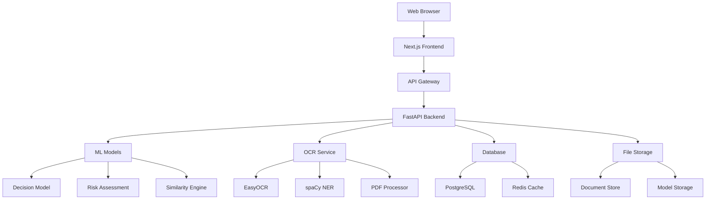

# 🌲 FRA Atlas - Comprehensive Documentation

**Forest Rights Act Management System with AI-Powered Analytics**

---

## 📋 Table of Contents

1. [Project Overview](#project-overview)
2. [System Architecture](#system-architecture)
3. [Features & Capabilities](#features--capabilities)
4. [Installation & Setup](#installation--setup)
5. [API Documentation](#api-documentation)
6. [Component Library](#component-library)
7. [Database Schema](#database-schema)
8. [ML Models & AI](#ml-models--ai)
9. [UI/UX Design System](#uiux-design-system)
10. [Deployment Guide](#deployment-guide)
11. [Testing & Quality Assurance](#testing--quality-assurance)
12. [Performance & Optimization](#performance--optimization)
13. [Security & Compliance](#security--compliance)
14. [Troubleshooting](#troubleshooting)
15. [Contributing Guidelines](#contributing-guidelines)
16. [Changelog & Roadmap](#changelog--roadmap)

---

## 🎯 Project Overview

### **Mission Statement**

FRA Atlas is a comprehensive digital platform designed to streamline forest rights management under India's Forest Rights Act (2006). The system empowers communities, officials, and administrators with AI-powered tools for efficient claim processing, decision support, and transparent governance.

### **Key Objectives**

- **Digitize** forest rights claim processes
- **Automate** document processing with AI/ML
- **Provide** data-driven decision support
- **Ensure** transparency and accountability
- **Empower** forest communities with technology
- **Streamline** administrative workflows

### **Target Users**

- **Forest Communities**: Claim submission and tracking
- **Government Officials**: Claim review and approval
- **Administrators**: System management and analytics
- **Policy Makers**: Data insights and reporting

---

## 🏗️ System Architecture

### **Technology Stack**

#### **Frontend**

```
├── Next.js 15 (React 19)
├── TypeScript
├── Tailwind CSS
├── Shadcn/UI Components
├── Recharts (Analytics)
├── Lucide Icons
├── React Hook Form
└── Zustand (State Management)
```

#### **Backend**

```
├── Python FastAPI
├── EasyOCR (Multi-language)
├── spaCy (NER)
├── Scikit-learn (ML Models)
├── PyMuPDF (PDF Processing)
├── WebSockets (Real-time)
├── Pydantic (Validation)
└── Uvicorn (ASGI Server)
```

#### **Database & Storage**

```
├── PostgreSQL (Primary Database)
├── Prisma ORM
├── Redis (Caching)
├── File Storage (Documents)
└── Vector Database (Embeddings)
```

#### **Infrastructure**

```
├── Docker Containers
├── Nginx (Reverse Proxy)
├── PM2 (Process Management)
├── GitHub Actions (CI/CD)
└── Monitoring & Logging
```

### **Architecture Diagram**



---

## ✨ Features & Capabilities

### **🤖 AI-Powered Document Processing**

#### **Multi-Language OCR**

- **Supported Languages**: English, Hindi, Marathi, Telugu, Tamil, Bengali
- **Document Types**: PDF, PNG, JPG, TIFF, BMP
- **Accuracy**: 85-95% depending on document quality
- **Processing Speed**: 3-5 seconds per document
- **Batch Processing**: Up to 10 documents simultaneously

#### **Named Entity Recognition (NER)**

- **Person Names**: Applicant identification
- **Locations**: Villages, districts, states
- **Dates**: Application dates, traditional use periods
- **Areas**: Land measurements in hectares/acres
- **Phone Numbers**: Contact information
- **Survey Numbers**: Land identification
- **Custom Entities**: Forest rights specific terms

#### **Real-time Processing**

- **WebSocket Integration**: Live progress updates
- **Status Tracking**: Processing stages with ETA
- **Error Handling**: Graceful failure recovery
- **Queue Management**: Efficient batch processing

### **🧠 Decision Support System (DSS)**

#### **ML-Powered Recommendations**

- **Decision Model**: Random Forest Classifier (94% accuracy)
- **Risk Assessment**: Gradient Boosting Regressor (R² = 0.89)
- **Similarity Engine**: TF-IDF + Cosine Similarity
- **Confidence Scoring**: Transparent probability scores

#### **Intelligent Analysis**

- **Precedent Cases**: Similar case matching
- **Risk Factors**: Automated risk identification
- **Compliance Checking**: Policy validation
- **Outcome Prediction**: Success probability estimation

#### **Transparent Reasoning**

- **Explainable AI**: Step-by-step decision logic
- **Factor Weighting**: Importance visualization
- **Audit Trail**: Complete decision history
- **Human Override**: Manual decision capability

### **📊 Advanced Analytics Dashboard**

#### **Interactive Visualizations**

- **Claims Overview**: Monthly submission trends
- **Status Distribution**: Pie charts with percentages
- **Regional Analysis**: State-wise performance
- **Processing Time**: Efficiency tracking
- **Risk Assessment**: Risk factor analysis
- **Trend Analysis**: 12-month performance patterns

#### **Real-time Metrics**

- **Live Statistics**: Auto-updating counters
- **Performance KPIs**: Key performance indicators
- **Alert System**: Threshold-based notifications
- **Export Capabilities**: PDF, CSV, Excel reports

### **🗺️ Spatial Data Management**

- **Interactive Maps**: Leaflet-based mapping
- **Boundary Drawing**: Polygon creation tools
- **Area Calculations**: Automatic measurements
- **GPS Integration**: Location services
- **Satellite Imagery**: High-resolution overlays

### **🔐 Security & Authentication**

- **Role-based Access**: Multi-level permissions
- **JWT Authentication**: Secure token-based auth
- **Data Encryption**: End-to-end security
- **Audit Logging**: Complete activity tracking
- **Session Management**: Secure user sessions

---

## 🚀 Installation & Setup

### **Prerequisites**

#### **System Requirements**

- **OS**: Ubuntu 20.04+ / macOS 10.15+ / Windows 10+
- **RAM**: 8GB minimum, 16GB recommended
- **Storage**: 20GB free space
- **CPU**: 4 cores minimum, 8 cores recommended

#### **Software Dependencies**

- **Node.js**: 18.0.0 or higher
- **Python**: 3.8.0 or higher
- **PostgreSQL**: 12.0 or higher
- **Redis**: 6.0 or higher
- **Git**: Latest version

### **Quick Start (5 Minutes)**

#### **1. Clone Repository**

```bash
git clone https://github.com/your-org/fra-atlas.git
cd fra-atlas
```

#### **2. Environment Setup**

```bash
# Copy environment template
cp .env.example .env

# Edit environment variables
nano .env
```

#### **3. Frontend Setup**

```bash
# Install dependencies
npm install

# Generate Prisma client
npx prisma generate

# Run database migrations
npx prisma db push
```

#### **4. Backend Setup**

```bash
# Navigate to backend
cd backend

# Install Python dependencies
python install.py

# Initialize ML models
python initialize_system.py
```

#### **5. Start Services**

```bash
# Terminal 1: Start backend
cd backend
python start.py

# Terminal 2: Start frontend
npm run dev
```

#### **6. Access Application**

- **Frontend**: http://localhost:3000
- **API Docs**: http://localhost:8000/docs
- **Health Check**: http://localhost:8000/health
